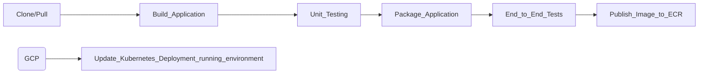

# Demo-Crm Application

> A SaaS microservices application showcasing DevOps best practices, including CI/CD pipelines, Kubernetes orchestration, Terraform infrastructure as code, and deployment on GCP.

## Table of Contents

- [Overview](#overview)
- [Architecture](#architecture)
- [Technology Stack](#technology-stack)
- [Prerequisites](#prerequisites)
- [Getting Started](#getting-started)
- [CI/CD Pipeline](#cicd-pipeline)

## Overview

This project showcases a SaaS-based application deployed on GCP using Kubernetes, with CI/CD automation through GitHub Actions. The project emphasizes:
Key features:

- Cloud-based infrastructure (GCP with Terraform)
- Microservices deployment using Kubernetes
- CI/CD automation via GitHub Actions
- Database integration with MongoDB
- Containerization using Docker & GCR

## Key Features

- REST API-based application using Next.js/Node.js
- Infrastructure as Code with Terraform
- Kubernetes cluster setup with GKS(EKS)
- Helm-based service deployment
- CI/CD workflows with automated testing & deployment

## Architecture

**3-Tier application architecture Diagram**


---

**GCP infrastructure architecture Diagram**


## Technology Stack

| Category             | Technologies            |
| -------------------- | ----------------------- |
| **Infrastructure**   | GCP, Terraform          |
| **Containerization** | Docker, GCR(EKS)        |
| **CI/CD**            | GitHub Actions          |
| **Version Control**  | GitHub                  |
| **Application**      | Next.js, Node.js, React |
| **Database**         | MongoDB                 |

## Prerequisites

Requirements for building and running the project:

- GCP CLI configured
- Terraform installed
- Kubernetes CLI (kubectl) installed
- Docker & Docker Compose installed
- Helm package manager installed

**Note: Infrastructure files are in demo-crm-infrastructure(Terraform)**

**Note: Cluster Resources file for Deployment is in demo-crm-cluster-resources(K8s)**

## Getting Started

### Infrastructure Setup

1. **Initialize Terraform & Authenticate with GCP:**

```bash

# Authenticate steps
gcloud auth application-default login
gcloud config set project YOUR_PROJECT_ID # project id from GCP

# Create a GCP Service Account
# Generate Service Account Key

# Terraform steps

terraform init
terraform plan
terraform apply
# make sure to shut down Infrastructure when finished with :
terraform destroy
```

### Application Deployment

2. **Configure a StorageClass - create volume in the cloud for MongoDB database**

```bash
kubectl apply -f storageclass-pd-balanced.yaml
```

3. **Setup and Deploy MongoDB (using Helm)**

```
helm repo add bitnami https://charts.bitnami.com/bitnami
helm install -f dbvalues.yaml my-mongodb bitnami/mongodb --version 16.4.3
```

```
#Expected output
export MONGODB_ROOT_PASSWORD=$(kubectl get secret --namespace default mymongodb -o jsonpath="{.data.mongodb-root-password}" | base64 -d)

To connect to your database, create a MongoDB&reg; client container:

    kubectl run --namespace default mymongodb-client --rm --tty -i --restart='Never' --env="MONGODB_ROOT_PASSWORD=$MONGODB_ROOT_PASSWORD" --image docker.io/bitnami/mongodb:8.0.5-debian-12-r0 --command -- bash

Then, run the following command:
mongosh admin --host "my-mongodb-0.my-mongodb-headless.default.svc.cluster.local:27017,my-mongodb-1.my-mongodb-headless.default.svc.cluster.local:27017" --authenticationDatabase admin -u root -p $MONGODB_ROOT_PASSWORD
```

**run the three**

3. **Deploy Next.js/Node.js Application (using Helm)**

```
helm install demo-crm .
```

4. **Set Up Ingress Controller**

```
helm repo add ingress-nginx https://kubernetes.github.io/ingress-nginx

helm install -n ingress --create-namespace controller ingress-nginx/ingress-nginx --set controller.ingressClassResource.default=true
kubectl apply -f demo-crm-ingress.yaml

#check creation
kubectl get service -n ingress
```

```
kubectl apply -f demo-crm-ingress.yaml

#check creation
kubectl get ingress
```

### Resources Cleaning

5. **Uninstalling MongoDB Using Helm**

```
helm list
helm delete my-mongodb
```

6. **Verifying Resources**

```
kubectl get all
kubectl get svc
kubectl get sc
```

7. **Deleting Storage Class**

```
kubectl delete sc storageclass-pd-balanced
```

8. **Deleting Persistent Volume Claims (PVCs)**

```
kubectl get pvc
kubectl delete pvc --all
```

9. **Uninstalling Application Using Helm**

```
helm uninstall demo-crm
```

9. **Uninstall Nginx Ingress Controller Using Helm**

```
helm uninstall controller -n ingress
#verify action
helm list -n ingress
```

10. **Delete Ingress Resource**

```
kubectl delete -f demo-crm-ingress.yaml
```

11. **Delete the Namespace**

```
kubectl delete namespace ingress

#Verify actions
kubectl get all -n ingress
kubectl get ingress -n ingress
```

**Note: must set up a domain and DNS record that will point to our Ingress Controller’s singular Load Balancer service**

## CI/CD Pipeline

**PIPELINE DESCRIPTION**



> Project-related repositories:

- https://github.com/osherd/demo-crm-cluster-resources
- https://github.com/osherd/demo-crm-infrastructure
